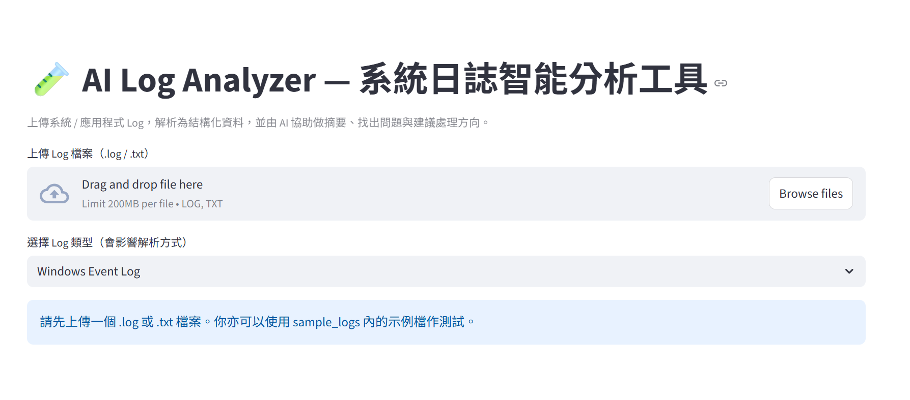

# 🧪 AI Log Analyzer — 系統日誌智能分析工具

這是一個針對 **系統與應用程式 Log** 的智能分析工具。  
系統會先將原始文字 Log 解析成結構化資料，再交由大型語言模型（LLM）進行摘要、問題歸納與建議排查步驟。

目前支援三種常見 Log 類型：

- Windows Event Log
- Linux syslog
- Application Log（自訂格式）

---

## 🌟 功能簡介

- ✅ 上傳 `.log` / `.txt` 檔案並選擇 Log 類型
- ✅ 依不同格式解析為結構化資料（pandas DataFrame）
  - Windows：`timestamp`, `level`, `source`, `event_id`, `message`
  - Linux：`month`, `day`, `time`, `host`, `process`, `pid`, `message`
  - App：`timestamp`, `level`, `module`, `message`
- ✅ 基本統計
  - 依 `level` 統計（Error / Warning / Info 等）
  - 依 `source` / `process` / `module` 統計 Top 10
- ✅ 篩選功能
  - 依 `level` 多選篩選
  - 依 `message` 關鍵字篩選
- ✅ AI 智能分析
  - 整體摘要：系統大致發生了什麼事
  - 問題與異常類型整理
  - 可能 root cause 推測
  - 建議排查與處理步驟
- ✅ 分析結果以 **Markdown** 輸出，方便直接貼給主管或團隊

---

## 🧱 技術架構

- 語言：Python 3.11
- UI：Streamlit
- 資料處理：pandas
- AI 模型：OpenAI Chat Completions API
- 設定與機密：
  - `.env` 用於存放 `OPENAI_API_KEY`
  - `config.py` 負責載入環境變數

---

## 📂 專案結構

```text
log_analyzer/
├─ app.py                # Streamlit 主介面（上傳 / 解析 / 統計 / 篩選 / AI 分析）
├─ config.py             # 載入 .env 中的 OPENAI_API_KEY
├─ requirements.txt      # 專案相依套件
├─ .env                  # 環境變數（不應加入版控）
├─ services/
│  ├─ __init__.py
│  ├─ openai_client.py   # 封裝 OpenAI API 呼叫
│  ├─ parser.py          # 針對不同 Log 類型的解析邏輯
│  └─ analyzer.py        # 使用 LLM 產生分析報告
└─ sample_logs/
   ├─ windows_events.log # Windows Event Log 範例
   ├─ linux_syslog.log   # Linux syslog 範例
   └─ application.log    # Application Log 範例
```

---

## 🚀 安裝與執行方式

### 1️⃣ 建立並啟動虛擬環境

```bash
python -m venv venv
venv\Scripts\activate     # Windows

# macOS / Linux
# source venv/bin/activate
```

### 2️⃣ 安裝相依套件

```bash
pip install -r requirements.txt
```

### 3️⃣ 建立 `.env` 並設定 OpenAI API Key

在專案根目錄建立 `.env`：

```env
OPENAI_API_KEY=your_openai_api_key_here
```

> ⚠️ `.env` 不應加入 Git 或公開儲存庫。

### 4️⃣ 啟動系統

```bash
streamlit run app.py
```

瀏覽器會開啟（預設 `http://localhost:8501`）：

1. 選擇 Log 類型（Windows / Linux / Application）
2. 上傳對應格式的 Log 檔案
3. 檢視解析後的結構化表格與基本統計
4. 使用 level / 關鍵字進行篩選
5. 按下「使用 AI 進行智能分析」，查看 Markdown 分析報告

---

## 🧠 設計重點

- 解析邏輯集中在 `services/parser.py`，方便未來擴充更多 Log 格式
- AI 分析集中在 `services/analyzer.py`，將 DataFrame 摘要成 LLM 可讀文字
- 若紀錄過多，只取前部分樣本供分析，避免請求過大
- 系統提示（system prompt）將模型設定為「資深系統工程師 / SRE」，讓回覆更貼近日常 IT 運維場景

---

## 📌 未來可延伸方向

- 對 Linux syslog 自動推斷 level（例如依關鍵字判定 ERROR / INFO）
- 支援更多 Log 格式（IIS、Nginx、應用程式 JSON log 等）
- 新增圖表視覺化（Error 趨勢、Top source / process 等）
- 與現有監控／工單系統串接（Prometheus、ELK、ServiceNow、JIRA 等）

---

## 👤 作者簡介

- 20+ 年企業 IT Support / Information Systems 經驗
- 熟悉企業 IT 環境中的工單處理、系統監控與故障排查流程
- 實作多個 AI 實戰專案（IT Helpdesk Chatbot、Ticket Auto-Triage、Log Analyzer）
- 專注將 LLM 技術落地於企業 IT 運維與自動化場景

## 🖼️ 介面截圖



---
